# R2R DAC

Der DAC wird zur Erzeugung der Referenz-Komparatorspannung verwendet. Für das Design soll ein einfacher DAC ohne Bufferstufe (OP-Amp) erstellt werden.  
Nachfolgend ist eine schematische Darstellung des DACs zu sehen:  

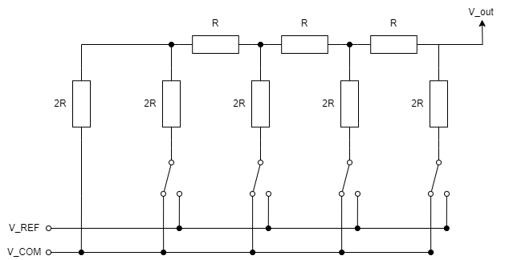  

Der DAC soll im SKY130-Prozess gefertigt werden. Die Widerstände und FETs sind in der Readthedocs-Dokumentation des PDK spezifiziert. Siehe [readthedocs](https://skywater-pdk.readthedocs.io/en/main/rules/device-details.html#generic-resistors).  


## Dimensionierung der Widerstände

Die `Generic resistors` werden nicht für analoge Designs empfohlen. Der `P-poly precision resistor` unterscheidet sich vom `P-poly resistor` durch ein separates Implantat, sodass der spezifische Flächenwiderstand bei 2000 Ohm/sq liegt (siehe readthedocs).  

Die Breiten sind dabei auf fünf Werte festgelegt:  
* 0.35 (0p35)  
* 0.69 (0p69)  
* 1.41 (1p41)  
* 2.85 (2p83)  
* 5.73 (5p73)  

Die Formel für den Widerstand lautet:  

$$
R = R_{sq} \cdot \frac{L}{W}
$$  

- $R$: Gesamtwiderstand  
- $R_{sq}$: Widerstand pro Quadrat (spezifischer Flächenwiderstand)  
- $L$: Länge des Widerstands  
- $W$: Breite des Widerstands  

Um einen Widerstand von $20 \text{k}\Omega$ zu erhalten, werden bei einem spezifischen Widerstand von $2000 \Omega/sq$ 10 Quadrate benötigt.  

Die Anzahl der Quadrate $N$ wird berechnet durch:  

$$
N = \frac{R_{\text{ges}}}{R_{sq}}
$$  

Dabei gilt:  
- $R_{\text{ges}} = 20 \text{k}\Omega$ (gewünschter Gesamtwiderstand)  
- $R_{sq} = 2000 \Omega/sq$ (spezifischer Widerstand pro Quadrat)  

$$
N = \frac{20 \text{k}\Omega}{2000 \Omega/sq} = 10 sq
$$  

Wenn die Breite des Widerstands $W = 35 \mu m$ beträgt, ergibt sich die Länge $L$ mit folgender Formel:  

$$
L = N \cdot W
$$  

$$
L = 10 \cdot 35 \mu m = 350 \mu m
$$  

Daraus folgt, dass der Widerstand eine Dimension von:  

$$
W = 35 \mu m, \quad L = 350 \mu m
$$  

oder:  

$$
0.35 \times 3.5 \mu m
$$  

### Magic PCELL-Konfigurationen / Einheitswiderstand  

Die Modellierung des Widerstands kann mit einer `PCELL` in Magic vorgenommen werden. Dabei wird der Widerstand direkt anhand des extrahierten Spice berechnet. Bei einer Länge von 3.5 µm und einer Breite von 0p35 beträgt der Widerstand 21.075 kΩ.  

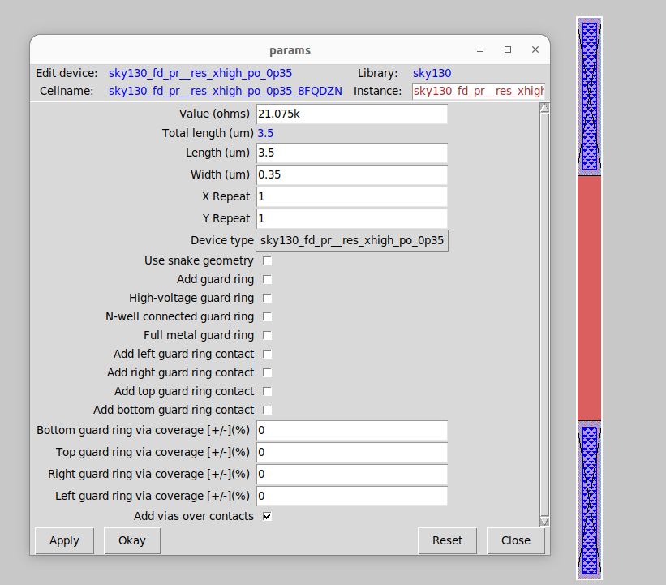  

Folgende Trade-offs müssen beachtet werden:  

- Der Strom durch den Widerstand darf 100 µA/µm nicht überschreiten (siehe readthedocs des PDKs).  
- Je kleiner der Widerstand, desto grösser wird der Fehler durch das $R_{DS_{on}}$ des MOS-Schalters.  
- Je grösser der Widerstand, desto stärker beeinflusst die Belastung den DAC, da die Ausgangsimpedanz zunimmt.  

Es wird 10 kΩ als Einheit gewählt. Bei einer Breite von 0p69 wird eine Länge von 3.5 µm pro Einheitswiderstand benötigt.  
Wenn alle Widerstände in eine Wanne mit Guardring gesetzt werden, können ohne Meander-Struktur (Snake Geometry) 28 Widerstände auf 9.37 µm x 33.86 µm platziert werden.  
Für einen 8-Bit-DAC werden 26 Widerstände benötigt.  

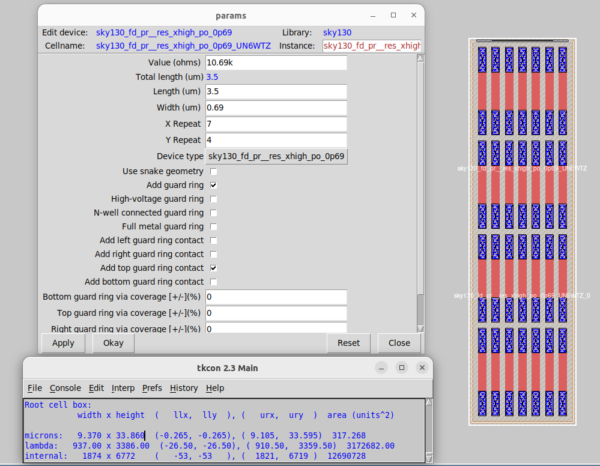  

Der maximale Strom, der durch den Widerstand fliesst, könnte analytisch berechnet werden. Dabei müssen jedoch einige Schleifen und Formeln aufgestellt werden. Eine einfache und sichere Alternative ist die Simulation mit SPICE. Ist der Umgang mit dem Simulator vertraut, kann diese Simulation schnell durchgeführt werden. Es wurde entschieden, dies in LTspice durchzuführen:

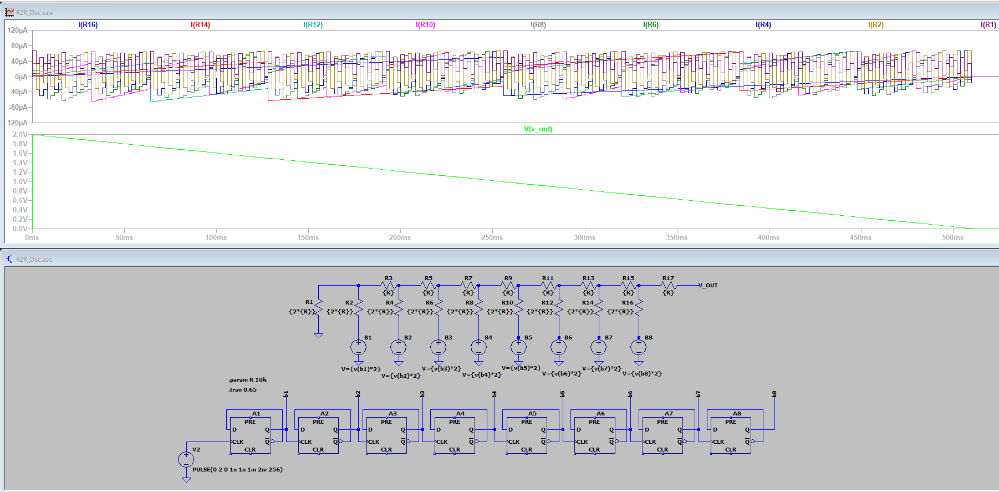 

Der R2R-DAC wird mit entsprechenden Widerständen aufgebaut. Mit D-Flip-Flops (DFF) wird ein Zähler konstruiert, der alle DAC-Werte erstellt. Die Ausgangsspannung beträgt dabei 1 V. Mit einer B-Source wird das jeweilige Bit (DFF-Ausgang: 1 V oder 0 V) auf 2 V ($V_{REF}$) verstärkt.

Bei einem Einheitswiderstand von 10 kΩ wird ein Strom von $\pm 75 \mu A$ erwartet.


### Test der Mismatch-Simulation  

Der Mismatch bestimmt die DNL und INL des DACs. Die Toleranz von Wafer zu Wafer ist vernachlässigbar, da mit reinen Verhältnissen gearbeitet wird. 2R muss einfach doppelt so gross wie R sein.  
Jeder Anschluss erhöht den Widerstand. Wenn ein 2R-Widerstand benötigt wird, sollten besser zwei einzelne Widerstände anstelle eines längeren Widerstands verwendet werden.  
Es wird angenommen, dass die Wanne keinen grossen Einfluss auf das Matching hat. Ebenso wird angenommen, dass die Einflüsse parasitärer Kapazitäten vernachlässigt werden können, da die Taktfrequenz sehr niedrig gewählt werden kann. Daher reichen `op`- oder `dc`-Simulationen aus.  

Die Dokumentation zu den Mismatch-Parametern des PDK ist begrenzt. Ein Codeblock `Corner` wird bereitgestellt, dem ein Argument wie `mc`, `tt`, `ff`, `ss`, `fs` oder `sf` übergeben werden kann.  
Ausser `mc` kann jeder Parameter mit dem Postfix `_mm` für Mismatch modifiziert werden. Für FETs konnte bereits erfolgreich eine Mismatch-Simulation erstellt werden (siehe `xschem/mismatch_test.sch`).  
Ob diese Parameter auch für Widerstände und Kondensatoren gelten, muss noch getestet werden.  

Es wurde eine Testbench erstellt, in der zwei Widerstände mit einer Spannungsquelle versorgt werden. Bei Mismatch sollten sich die Widerstandswerte unterscheiden.  
Bei Monte-Carlo-Simulationen sollte sich der Wert bei mehreren Simulationsläufen ändern.  

Da kein dynamisches Verhalten (Umladen von Cs) oder Spannungsänderungen (`dc`-Simulation) für den Test benötigt wird, wird eine `op`-Simulation in einer Schleife durchgeführt.  
Der Widerstandswert wird bei jedem Durchlauf berechnet und in einem Vektor gespeichert. Mit `ngspice` kann der Vektor dann als Graph ausgegeben werden:  

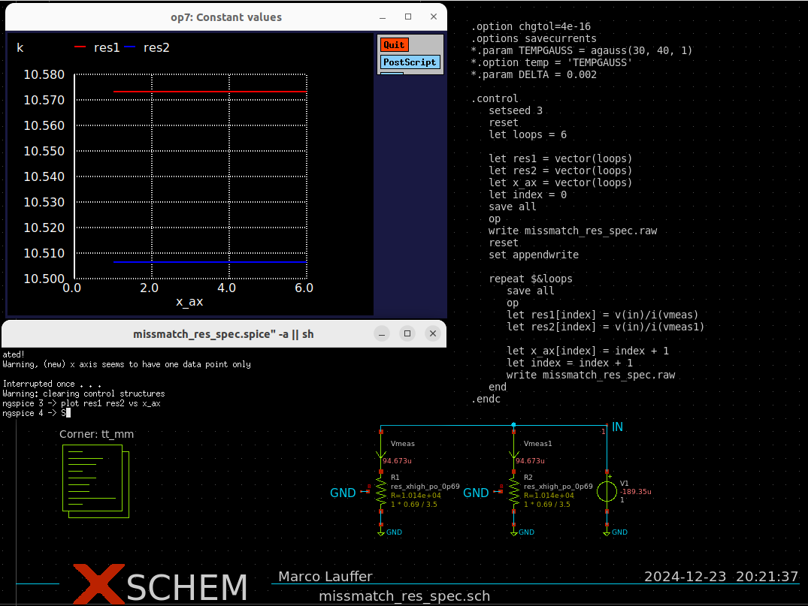  

Die Widerstände zeigen wie erwartet unterschiedliche Werte. Diese bleiben jedoch über mehrere Simulationsläufe konstant!  
Direkt in `xschem` kann der Vektor nicht ausgegeben werden, da der Sweep-Vektor (X-Achse) nicht aus dem `const`-Plot verwendet werden kann. In `ngspice` kann mit `plot y vs x` der Sweep (X-Achse) ausgewählt werden (siehe README `xschem_ngspice.md`).  

Das Simulationssetup wird auf eine `dc`-Simulation umgestellt, um die Darstellung in `xschem` zu erleichtern. Dabei wird die Temperatur anstelle der Spannung variiert.  
Es wird keine Spannungsabhängigkeit des Widerstands erwartet.  

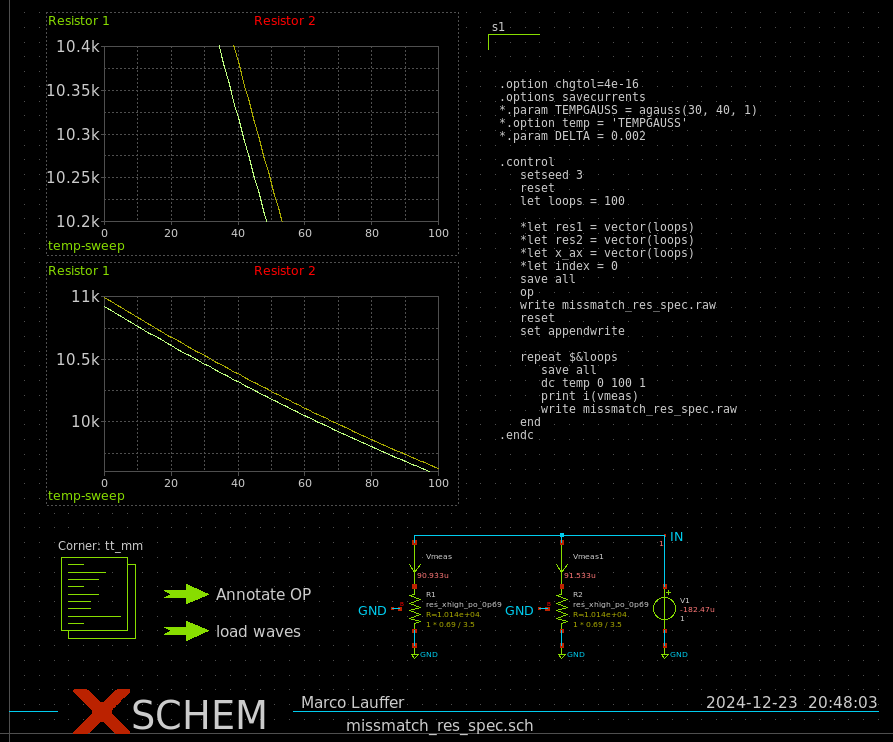  

Auch hier ist keine Variation zwischen den Läufen erkennbar. Alle 100 Läufe liegen exakt übereinander. Der Mismatch scheint jedoch zu funktionieren, da die Widerstände unterschiedliche Werte aufweisen.  

> **Wichtig:**  
> Im Loop/Repeat muss der `reset`-Befehl gegeben werden, um die Parameter neu zu setzen (siehe Videoanleitung von [bminch](https://www.youtube.com/watch?v=fXaXTALecr8&t=233s)).  

Durch den `reset`-Befehl im Loop sind Änderungen bei jedem Durchlauf sichtbar:  

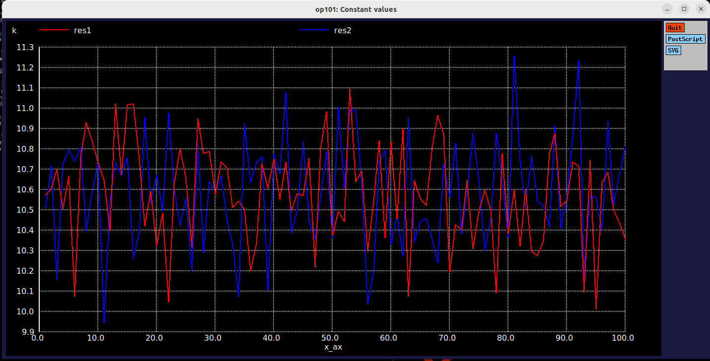  


Etwas unklar bleibt der Parametersatz `mc` und `tt_mm`. Im Slack-Kanal **open-source-silicon.dev** sind die Maintainer von `xschem` und des PDK aktiv. Dabei wurde auch auf die Corners eingegangen.  

Nach dem Chatverlauf sollte der Parameter `mc_mm` zur Verfügung stehen. Dieser ist jedoch nicht im PDK enthalten.  
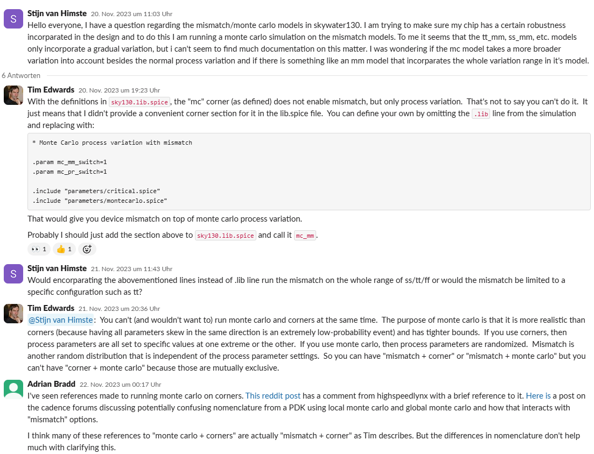  

Aufgrund des Chatverlauf wird angenommen, dass der Mismatch die Änderung des Widerstandswerts von einem zum anderen Widerstand auf demselben Wafer beschreibt. Dies ist relevant.  
Wenn der gesamte Wafer um 10 % höhere Widerstandswerte aufweist, ist dies beim R2R irrelevant, solange die Lastimpedanz und das $R_{DS_{on}}$ des Schalters sehr klein sind.  

Für diese Simulationen wird der Corner `tt_mm` gewählt.  


## Dimensionierung der FET

Für jedes Bit muss zwischen $V_{Ref}$ und $V_{COM}$ umgeschaltet werden. Dies kann mit einem Inverter (PFET - NFET) wie im folgenden Schema realisiert werden:  

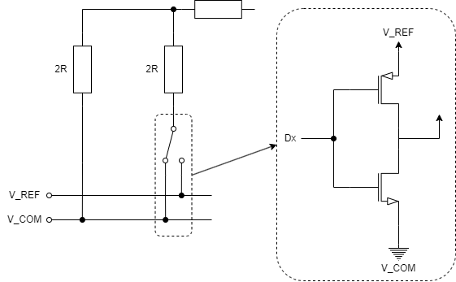  

Folgende Trade-offs müssen beachtet werden:  

- Der Widerstand $R_{DS_{on}}$ muss deutlich kleiner sein als $R$, damit der Fehler möglichst gering bleibt.  
- Die Ansteuerung erfolgt durch den digitalen Teil. Entsprechend liegt die Spannung $D_x$ bei $V_{D_{PWR}} = 1.8V$.  
- Der Querstrom sollte überprüft und optimiert werden (dies ist jedoch weniger kritisch als bei einem CAP-DAC, da keine Ladung verloren geht). Dies kann durch die Dimensionierung oder durch den digitalen Teil mittels `Break-Before-Make` erreicht werden.  

Die FETs werden als Schalter dimensioniert.  

Bei kleinen Drain-Source-Spannungen $V_{DS}$ kann der Drain-Source-Strom $I_D$ mit folgender Gleichung beschrieben werden [1, Eq. (1.51)]:  

$$ 
I_D = \mu_n Q_n \frac{W}{L} V_{DS} 
$$  

- $\mu_n$: Beweglichkeit der Elektronen in der Nähe der Siliziumoberfläche  
- $Q_n$: Ladungskonzentration des Kanals pro Flächeneinheit    
- $W$: Breite des MOSFET-Kanals    
- $L$: Länge des Kanals    
- $V_{DS}$: Drain-Source-Spannung    

Die folgende Abbildung stammt aus [1]:  

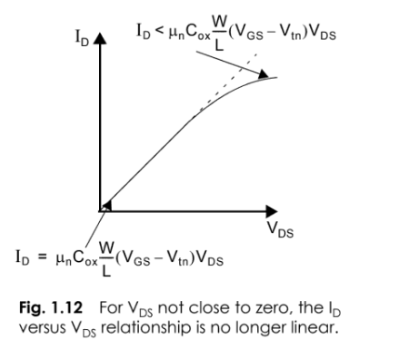  

Herr Carsten Wulff zeigt jedoch in seiner [Präsentation](https://analogicus.com/aic2024/2024/09/11/SPICE.html) und seinem [YouTube-Video](https://youtu.be/z9go-m0hnIg?si=Wjbk-50xM0hINQm7&t=849), dass diese Formeln bei kleinen Strukturen nicht mehr gültig sind. Die Zusammenhänge sind komplex. Beispielsweise besitzt das `BSIM 4.5` (Berkeley Short-channel IGFET Model) SPICE-Modell 284 Parameter.  

Seine Empfehlung: Für Analogdesign sollte ein Transistor mit `unit size` verwendet werden, und $L_{min}$ sollte aufgrund der verwendeten `Halo Doping`-Technologie bei minimalen Strukturen um ca. den Faktor 1.2 vergrössert werden. Der FET sollte mit einer SPICE-Simulation charakterisiert werden.  

Formel (1.51) kann jedoch für eine heuristische Abschätzung verwendet werden. Je grösser $W$ und je kleiner $L$, desto grösser ist $I_D$. Die Schaltaufgabe ist nicht besonders kritisch.  

Im PDK sind bestimmte $W/L$-Verhältnisse bereits charakterisiert (siehe [read-the-docs](https://skywater-pdk.readthedocs.io/en/main/rules/device-details.html#v-10-5v-nmos-fet)). Es wird der `IDSNS50H` ausgewählt ($W/L = 7/0.5$) und in einer Testbench charakterisiert. Dies ergibt einen Widerstand von etwa 600 $\Omega$:  

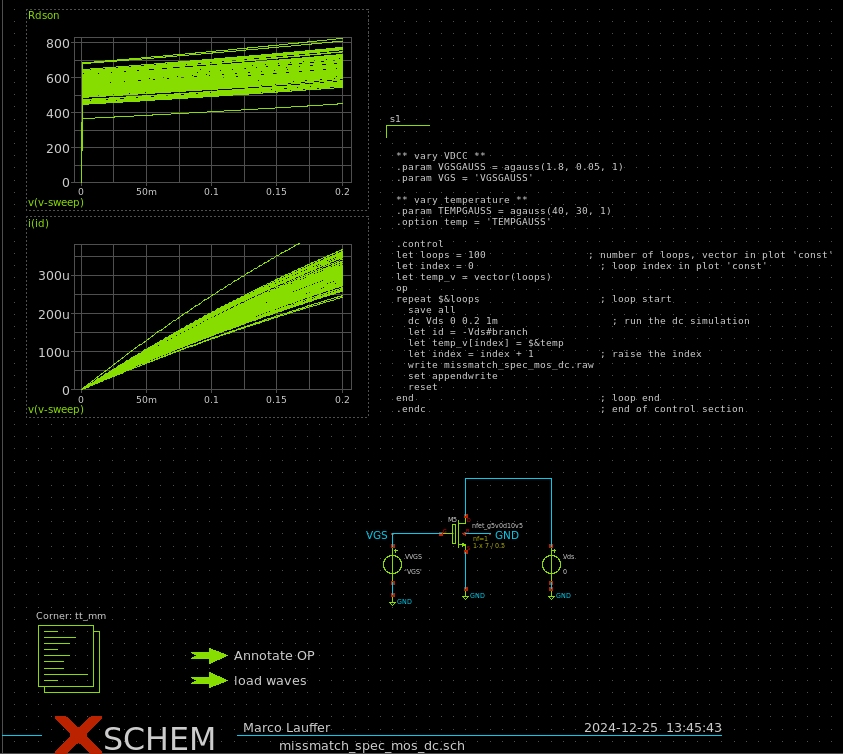  

Die gleiche Simulation wurde mit dem PFET durchgeführt. Damit sich auch hier ein Widerstand von etwa 800 $\Omega$ ergibt, muss ein $W$ von $16\,\mu m$ gewählt werden:  

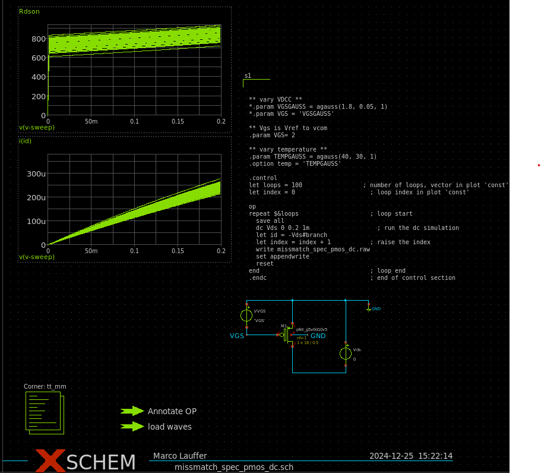  

600 $\Omega$ und 800 $\Omega$ gegenüber dem 2R-Pfad von 20k verursachen einen Fehler von 4 %. Dies ist vergleichsweise hoch. Eine Verbesserung lässt sich durch Optimierung der Schalter oder durch Erhöhung der Widerstände von R = 10k auf R = 20k erreichen. Der Komparator sollte eine sehr hohe Eingangsimpedanz aufweisen. Dadurch wird die Quellenimpedanz des DACs weniger relevant. Es wurde entschieden, den Einheitswiderstand auf 20k zu erhöhen.  

Der DAC-Schalter wurde in ein Schaltplansymbol gewandelt und die DC-Eigenschaften mit einer Testbench überprüft. Der zu schaltende Strom liegt bei ca. $37\mu A$. Bei $V_{REF}$ von 2 V ergibt sich ein Widerstand von ca. $54k\Omega$. Für die Simulation wurde ein tieferer Widerstand von 40k angesetzt. Damit wird der schlechtere Fall Simuliert. Der Treiberstufe wurde ein Steuersignal von 1,8 V und 0 V zugeführt. Mit einer `op`-Simulation wurden die Knoten berechnet und die Spannung am Ausgang aufgezeichnet. In der Simulation wurden Temperatur, Versorgungsspannung (Vcontrol) und die FET-Parameter mit Mismatch berücksichtigt. Die gemessenen Daten können in eine Textdatei geschrieben und mit Octave geplottet werden.  

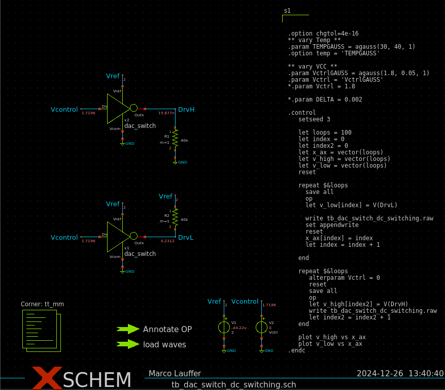  

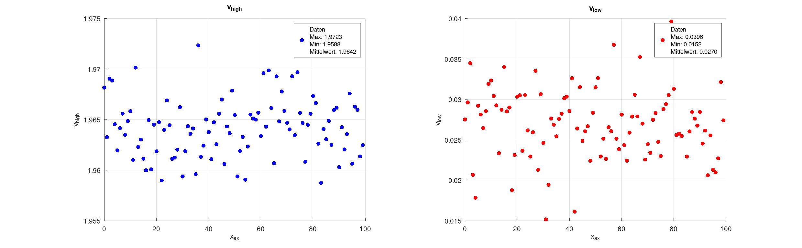  

Das transiente Verhalten kann ebenfalls simuliert werden. Dabei sollte der Querstrom beobachtet werden. Dieser liegt bei einer Ansteuerung mit 1 ns $T_{rise}$ bei ca. 210 $\mu A$. Eine Optimierung ist möglich, wird aber zum aktuellen Zeitpunkt als ausreichend angesehen.  

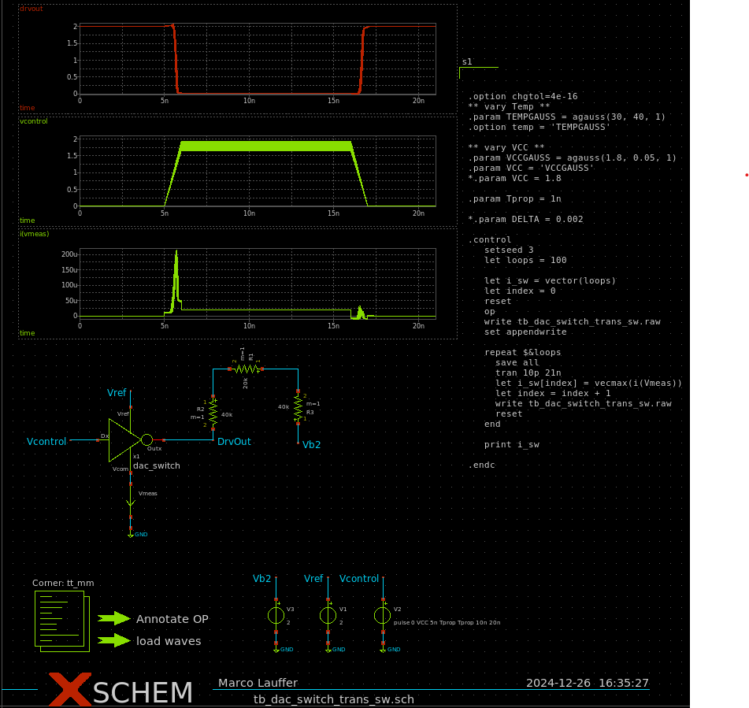  

Typischerweise werden Inverter mit einer DC-Analyse verifiziert. Die folgenden Abbildungen stammen aus [1], Kapitel 11.  

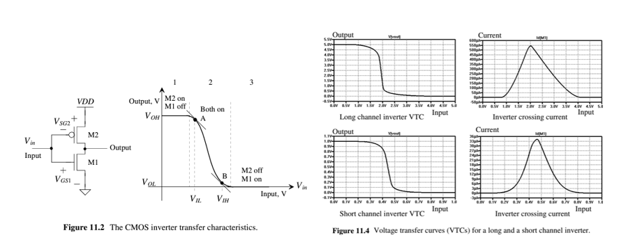  

Der DAC-Schalter wurde ebenfalls mit einer DC-Analyse verifiziert. Das transiente Verhalten ist jedoch deutlich pessimistischer als die DC-Analyse. Simulationen wurden auch mit anderen Corners (`ff`, `sf`, `fs`) durchgeführt. Dabei wurde jedoch nie mehr als 210 $\mu A$ gemessen.  

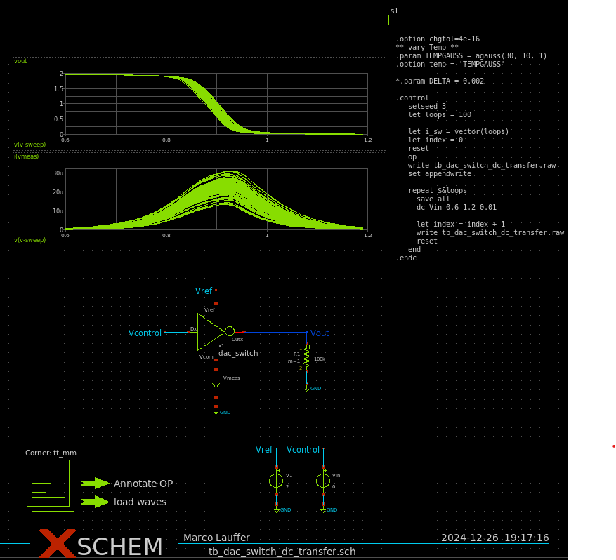  

### Toplevel DAC-Simulation  

Der Schalter für den DAC und die entsprechenden Widerstände wurden ausgewählt. Diese müssen nun mittels hierarchischen Schaltplänen zu einem Top-Level-Spice-Block zusammengesetzt werden. Mit diesem Modell kann die Performance des DACs in einer Testbench ermittelt werden.  
Für den DAC-Schalter wurde bereits ein Modell erstellt, ebenso für die Widerstände. Diese beiden Blöcke wurden in einem Schaltplan verbunden, woraus erneut ein Modell generiert wurde. Die folgende Abbildung zeigt das Schema:  

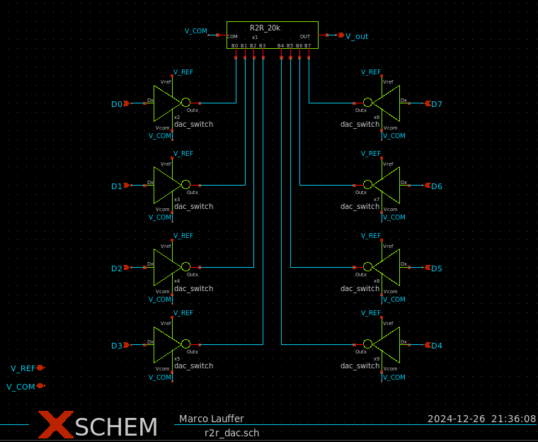  

Mit dem Modell wurde eine Testbench erstellt. `xschem` bietet die Möglichkeit, Spice-Quellen mit einer Metasprache, dem `utile Stimuli Editor`, zu beschreiben. Dies vereinfacht die Erstellung der `PWL Vsource`. Der folgende Ausschnitt setzt alle Spannungen `v_b[0:7]` nach 5 ns auf 0. Nach weiteren 5 ns wird `v_b0` auf logisch `1` gesetzt. Das logische `1` kann mit einem Spice-Parameter festgelegt werden. In diesem Fall entspricht es der Betriebsspannung von 1,8 V.  

```plaintext
beginfile stimuli_tb_dac_codes.cir

s 5
set v_b0 0
set v_b1 0
set v_b2 0
set v_b3 0
set v_b4 0
set v_b5 0
set v_b6 0
set v_b7 0

s 5
set v_b0 1


```
Die Quellen werden in der Datei `stimuli_tb_dac_codes.cir` geschrieben. Im Testbench-Code wird diese Datei inkludiert.
Mit Python kann eine `utile Stimuli`-Datei für alle 256 Codewörter erstellt werden. Der folgende Code zeigt die benötigte Schleife:

```Python
for i in range(256):

    print("")
    print("s 5")

    bin_str = f"{i:08b}"
    for j in range(8):
        print(f"set v_b{j} {bin_str[7-j]}")
```

Die Funktion des DACs kann initial überprüft werden. Eine Testbench wurde erstellt, die die Stimuli-Datei lädt und den DAC entsprechend verbindet. Der DAC scheint korrekt zu funktionieren. Es sind auch die typischen Umschaltspitzen bei der Hälfte und beim Viertel zu erkennen. Diese entstehen durch den Signalwechsel am Eingang des DACs.


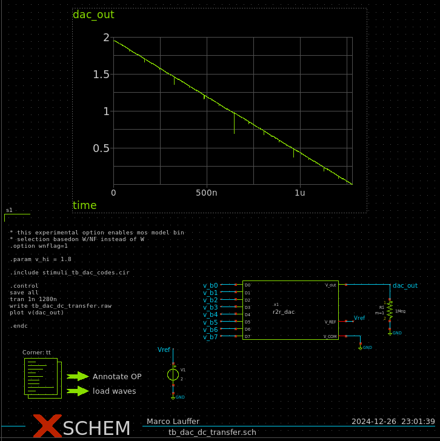

Anschliessend wurde der mittlere Übergang vergrössert dargestellt. Beim Wechsel vom Codewort 0x7F auf 0x80 werden einige Zwischenwerte durchlaufen:

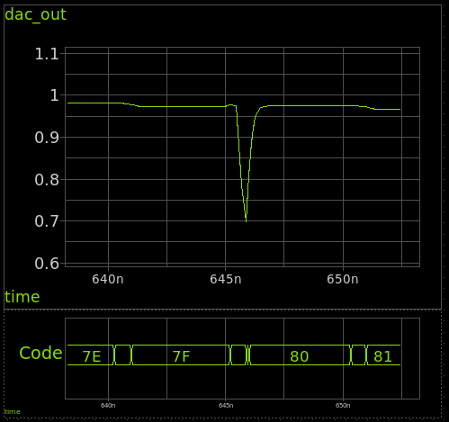


In der `tran`-Simulation wird alle 5 ns der Eingangscode gewechselt. Kurz vor dem Wechsel soll eine Messung durchgeführt werden, die zur Performance-Verifizierung des DACs verwendet wird.  

In der Testbench des DACs werden die Ausgangswerte in eine `raw`-Datei gespeichert. `ngspice` kann diese `raw`-Datei einlesen und nachträglich Messungen ausführen.  

Im File `dac_perf_sim.cir` werden die Simulatoranweisungen für die Messung geschrieben. Die Messungen werden in eine Textdatei ausgegeben. Nachfolgend ein Ausschnitt der Simulatoranweisungen:  

```spice
.control
*.... other code here

load simulation/tb_dac_performance.raw

repeat $&sim_loops

    * set the tran sim run
    setplot tran{$&plotnr}
    repeat 256
        
        meas tran v_dac find v(dac_out) at=$&tm

        let dac_values[index] = v_dac
        let x_ax[index] = index
        let tm = tm + 5n
        let index = index + 1

    end
* .... other code here

wrdata dac_data.txt dac_values vs x_ax
```

Am Simulator kann dieses File mitgegeben werden:

```sh
$> ngspice -i simulation/dac_perf_sim.cir -a
```

Aus diesen Messdaten kann dann die Integral Nonlinearity (INL) und die Differential Nonlinearity (DNL) berechnet werden.

Die DNL kann mit folgender Formel bestimmt werden:

$$
DNL(i) = \frac{V_{out}(i+1) - V_{out}(i)}{V_{LSB}} - 1
$$

Die INL kann mit folgender Formel bestimmt werden:

$$
INL(i) = \frac{V_{out}(i) - V_{ideal}(i)}{V_{LSB}}
$$

Das erstellte Textfile kann mit Python eingelesen und die entsprechenden Werte können berechnet werden.  

Die folgenden Plots entstanden mit dem Python-Skript `dac_perf.py` im Ordner `xschem/python`.

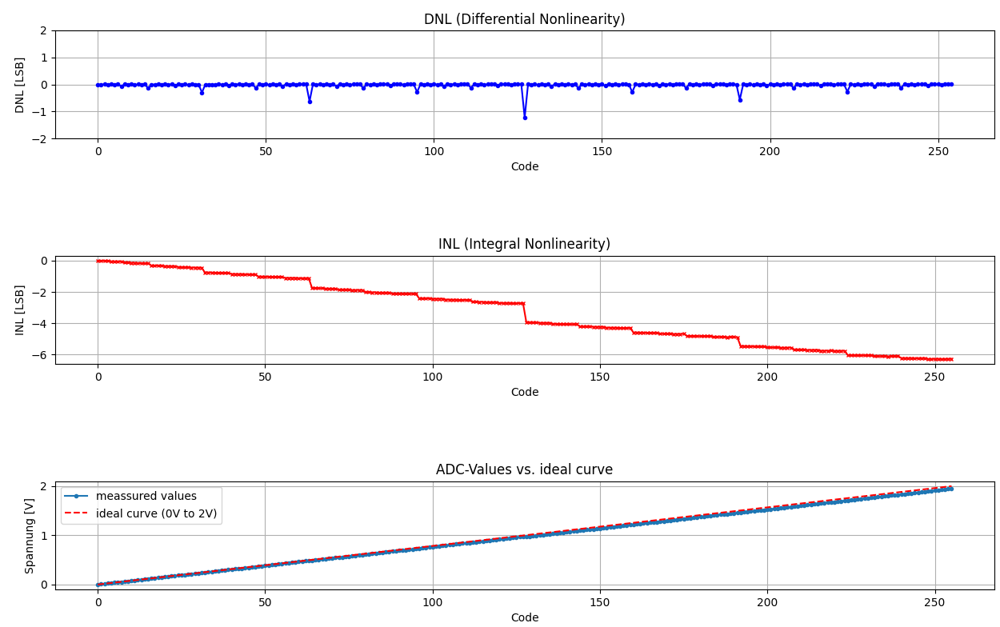

Aus der Auswertung wird Folgendes interpretiert:

* Die Ausreisser bei der DNL nahe und über 1 LSB (128/64) resultieren aus dem Widerstand des DAC-Schalters. Diese Ausreisser verursachen auch die Stufenbildung bei der INL.
* Anhand der INL kann ein Gain-Fehler erkannt werden. Abgesehen von den Stufen sinkt der Funktionswert monoton.

Der Offset wurde auf einfache Weise herausgerechnet, indem der Wert beim Codewort 0 von allen anderen Codewörternwerten subtrahiert wurde. Eine genauere Methode ist ein Funktionsfitting mit Least squares. Dies kann mit der polyfit-Funktion der in Python verwendeten Bibliothek `numpy` leicht umgesetzt werden:

```python
#better offset compensation is to create a linear regression with a ployfit (least squares) 1 deg
dummy_x = np.arange(len(voltages))

# std form of linear function x = ax+b
a,b = np.polyfit(dummy_x,voltages,1)
offset = b

voltages_no_offset = voltages -offset
```
Diese Methode zeigt jedoch keine Verbesserung der INL.

Der Gain-Fehler kann durch eine hohe Ausgangslast des DACs verursacht werden. In der ursprünglichen Simulation wurde der DAC mit `1 Meg` belastet. In der überarbeiteten Simulation wurde die Last auf `100 Meg` erhöht. Zusätzlich wurde der DAC-Schalter um den Faktor 5 vergrössert (NFET 16/0.5 und PFET 35/0.5, jeweils mit nf = 5). Dadurch reduziert sich der Widerstand auf ca. 100 - 150 Ohm, was deutlich kleiner ist als 40 kΩ (2R -> 20 kΩ entspricht 1R). Die folgende Abbildung zeigt die Wiederholung der Simulation der DAC-Schalter-FETs:

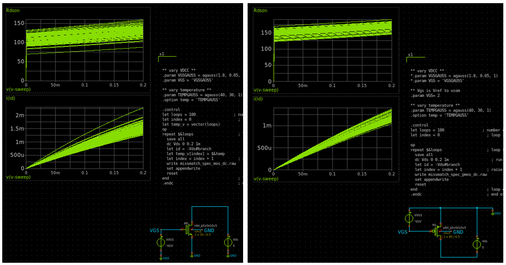

Die Simulation des DACs wurde mit den neuen DAC-Schaltern und der neuen DAC-Last von 100 Meg wiederholt. Die folgende Abbildung zeigt das Ergebnis. Eine deutliche Verbesserung ist erkennbar – INL und DNL liegen nun innerhalb von $\frac{1}{2}$ LSB:

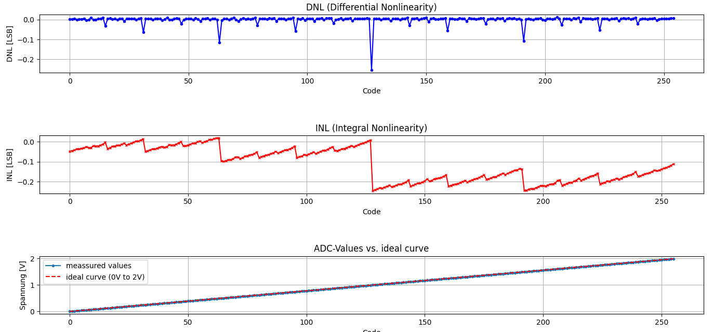

Es wird jedoch ein deutlich höherer Querstrom erwartet, da der Kanalwiderstand erheblich reduziert wurde. Eine Verzögerung des PFETs könnte durch den Einsatz von zwei Invertern erreicht werden. Vorerst wird jedoch keine weitere Optimierung vorgenommen.

## Layout

Die Widerstände im DAC sind kritisch für das Matching. Entsprechend sollte dies beim Layout berücksichtigt werden. In [1] wird das Common-Centroid-Layout (CC) vorgestellt. Damit soll der Fehler durch Prozessgradienten minimiert werden.

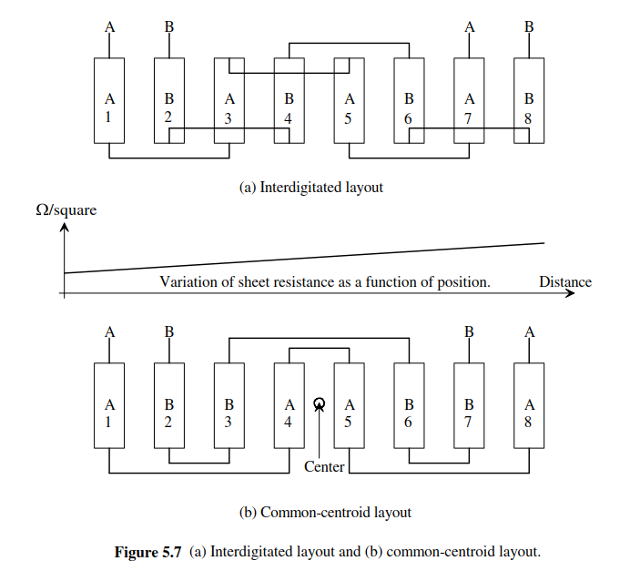

Weiterhin wird auf das `substrate noise` eingegangen. Dieses kann durch einen `Guard Ring` reduziert werden. Folgend ein Ausschnitt aus [1]:

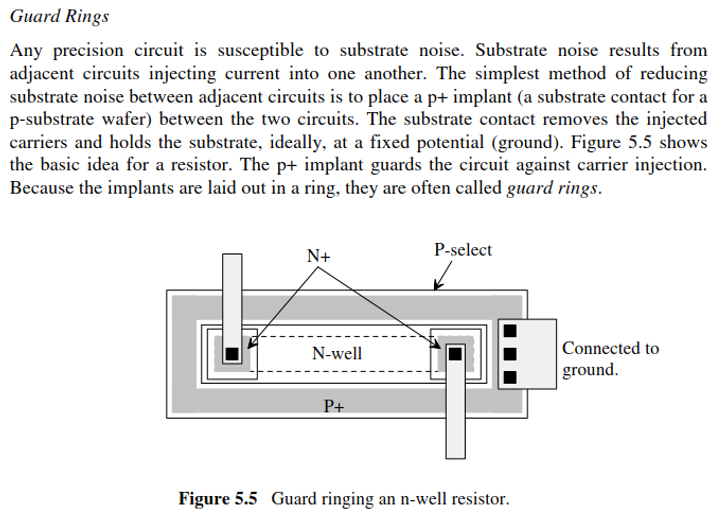

Um ein ideales CC-Layout zu erreichen, kann der Widerstand $R$ in weitere Einheiten unterteilt werden. Diese Einheiten werden gleichmässig um ein Zentrum verteilt. Die ideale Verteilung könnte mithilfe von Algorithmen automatisiert werden [2]. Da das Layout-File textbasiert ist, wäre es möglich, ein entsprechendes Tool in Python zu entwickeln. Dies liegt jedoch ausserhalb des Projektumfangs. 

Aufgrund der ungeübten Handhabung des Layout-Tools `Magic` wurde auf ein besseres Matching mit CC verzichtet. Stattdessen wurde eine `PCELL` konfiguriert, die 27 Widerstände à 20 $k\Omega$ mit einem Guard Ring erzeugt. Der Guard Ring ist oben offen (kein Top-Metal, jedoch Left, Right und Bottom Metal). Das Routing wurde auf Metal 1 (violett) durchgeführt. Die folgende Abbildung zeigt die Konfiguration der `PCELL` sowie das Layout der R2R-Widerstände. Die Abbildung unten rechts zeigt den isolierten M1-Layer. Links und rechts wird jeweils ein Widerstand als Dummy verwendet, der kurzgeschlossen ist.

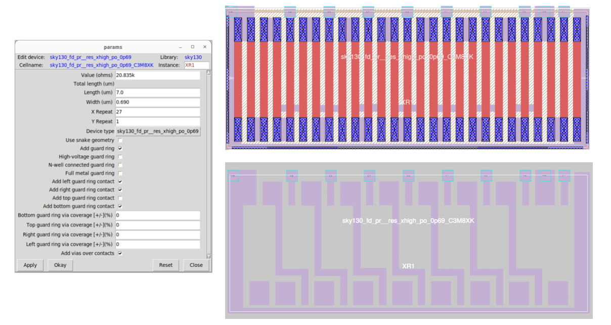

Durch die Verteilung entsteht eine Breite des R2R-Netzwerks, entlang derer die DAC-Switches angeordnet werden können. Dabei wurde nicht weiter auf das Matching geachtet. Der PFET und NFET liegen übereinander, und das Layout wurde auf Metal 1 (violett) und Metal 2 (pink) ausgeführt. Die folgende Abbildung zeigt das Layout sowie isoliert die Metallschichten M1 und M2.

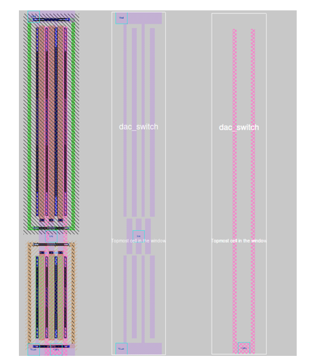

Auf einer höheren Hierarchieebene können die erstellten Zellen (DAC-Switch und R2R Netzwerk) in ein Layout für den gesamten R2R-DAC integriert werden. Die folgende Abbildung zeigt das gesamte Layout des DACs. Rechts sind die Metallagen M1 (violett) und M2 (pink) isoliert dargestellt.

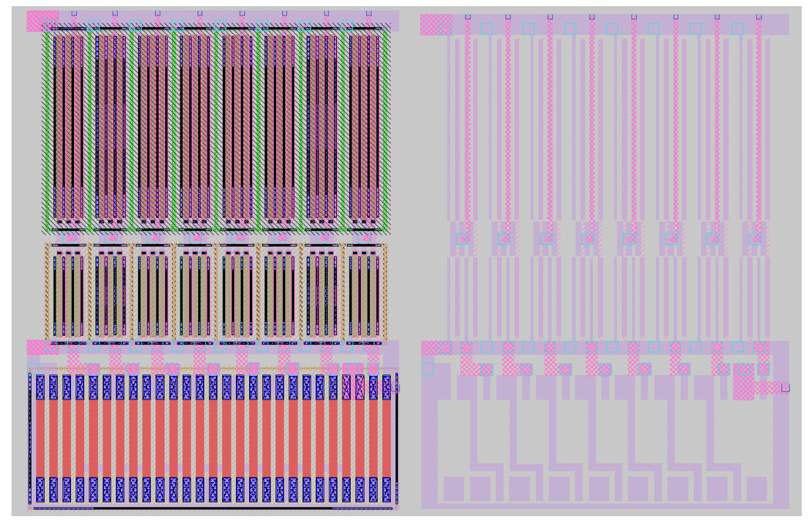

### LVS und parasitäre Extraktion

Der DAC-Switch, das R2R-Netzwerk und der gesamte DAC können mit LVS überprüft werden. Dazu muss jeweils aus dem Schaltplan eine Netzliste erzeugt werden. Die folgenden `make`-Befehle zeigen den Prozess:

```bash
cd xschem
make netlist_lvs
cd ./../mag
make lvs
```
Aus dem Layout können die parasitären Widerstände und Kapazitäten extrahiert werden (Parasitic Layout Extraction  siehe [read-the-docs](https://skywater-pdk.readthedocs.io/en/main/rules/rcx.html)). Dieser `parax` Schritt wurde ebenfalls ins Makefile integriert und kann mit `sim` ausgeführt werden:

```bash
cd mag
make sim
``` 


Der Schritt erzeugt ein `subckt` in einer `.spice`-Datei. Die so erzeugte Datei für den R2R-DAC befindet sich in `xschem/extracted/` und kann im Schematool `xschem` in der Testbench verwendet werden. Das Symbol muss mit den folgenden Eigenschaften versehen werden:

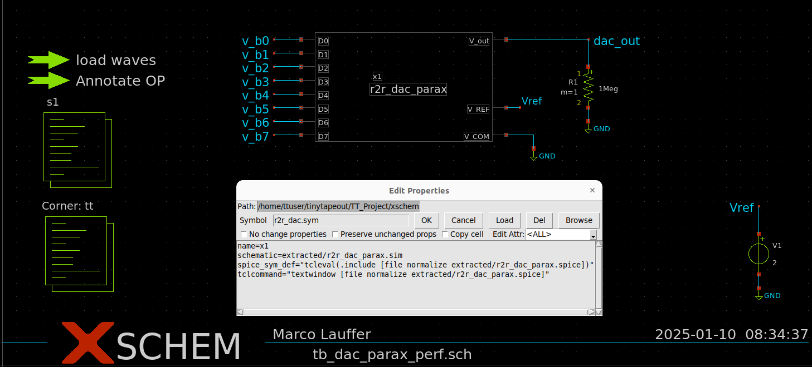

Die Testbench des DACs wurde mit dem `parax`-Modell wiederholt simuliert. Es konnten keine signifikanten Verschlechterungen festgestellt werden. Die folgende Abbildung zeigt die Simulation der Testbench `xschem/tb_dac_parax_perf.sch`:

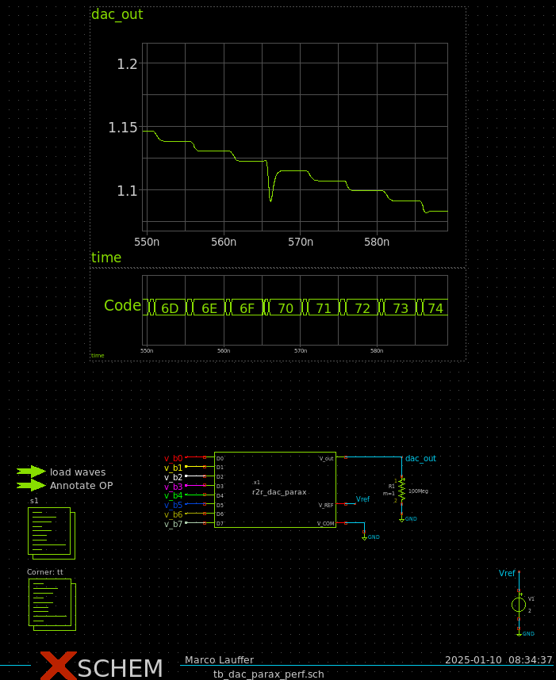


## Konklusion

Beim Entwurf und Design wurde vorwiegend auf Einfachheit geachtet. Unter den getesteten Bedingungen konnte in der Simulation ein DNL von $< 0.3 \text{LSB}$ erreicht werden. Mit einer Offsetkompensation (Polynomfit ersten Grades) lag auch der INL bei $< 0.3 \, \text{LSB}$. Beim Layout der Widerstände wurde darauf geachtet, dass diese möglichst dicht angeordnet und mit einem Guard-Ring geschützt werden. Die Metallleitungen wurden bei den Schaltern und Widerständen möglichst breit ausgeführt und mit mehreren Vias verbunden. Bei der parasitären Extraktion konnte keine signifikante Verschlechterung festgestellt werden.

Vielerorts könnten jedoch Optimierungen vorgenommen werden: 
- Im Design könnte mit einer Break-Before-Make-Schaltung der Querstrom des DAC-Schalters deutlich verringert werden. Dies liesse sich durch zwei Flipflops erreichen, die nacheinander getaktet werden. Häufig wird jedoch einfach die Gatterlaufzeit von zwei Invertern verwendet.  
- Die kapazitive Last des DAC-Schalters sollte nicht direkt durch ein Logik-Gatter des digitalen Teils angesteuert werden. Stattdessen wäre eine Inverterkette mit aufsteigender Treiberleistung sinnvoll, wie sie beispielsweise im Design von Tim Edwards im IP-Block [8-bit Resistive Ladder DAC](https://github.com/RTimothyEdwards/sky130_ef_ip__rdac3v_8bit/tree/main) umgesetzt wurde.  
- Der Referenzspannungsbereich des DACs könnte erweitert werden, wenn von der digitalen Ansteuerung mit \( 1.8 \, \text{V} \) ein Levelshift auf \( 3.3 \, \text{V} \) im Design vorgenommen würde. Auch dies wird von Edwards in seinem Design implementiert.

Die folgende Abbildung zeigt das Schema des genannten Designs:

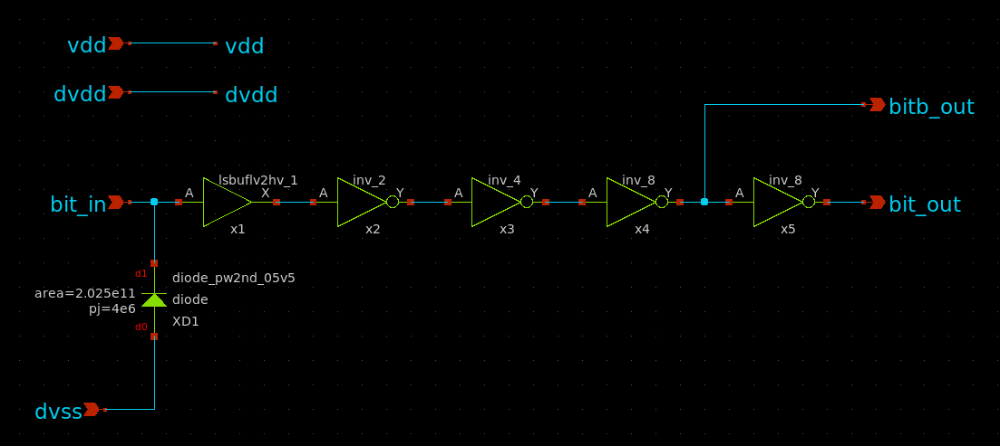


Weitere Optimierungen können aus dem Buch  *Analog Integrated Circuit Design* [1] entnommen werden. Beispielsweise wird in [1, Figure 30.6] (untere Abbildung oben links) die Segmentierung der Widerstände behandelt. Möglichkeiten zur Kompensation des Schalterwiderstands mit einem `Dummy Switch` sind in [1, Figure 29.6] (untere Abbildung unten links) beschrieben. In [1] wird die Segmentierung von Voltage-Mode-DACs nicht weiter vertieft; hierzu existieren jedoch andere Literaturquellen, wie beispielsweise [3]. Zudem werden in [1] Layout-Optimierungen mit Common-Centroid-Strukturen vorgestellt ([1, Figure 5.28(a)] und [1, Figure 5.29], oben und unten rechts).


Die Verifizierung der Funktionsblöcke erfolgte mit entsprechenden Testbenches in Form von `xschem`-Schemas. Es wurden jedoch keine automatisierten Charakterisierungen mit entsprechenden Tools durchgeführt. Für ein neues Design wäre der Einsatz eines solchen Tools nach Aussage von Tim Edwards sehr empfehlenswert, da bei jeder Anpassung alle definierten Spezifikationen und Messungen über alle Bedingungen (Corner, Speisespannung, Temperatur etc.) überprüft und ein Bericht generiert wird [4]. Dies kann durch eine CI-Pipeline automatisiert werden, die bei jedem Einchecken alle Parameter prüft. Entsprechende Tools, namentlich [cace](https://github.com/efabless/cace?tab=readme-ov-file) von Tim Edwards oder [cicsim](https://github.com/wulffern/cicsim) von Carsten Wulff, stehen frei zur Verfügung.


### Referenzen  

[1] Carusone, T. C., Johns, D., Martin, K. (2012). *Analog Integrated Circuit Design*. Vereinigtes Königreich: Wiley.  

[2] V. Borisov, K. Langner, J. Scheible and B. Prautsch, "A novel approach for automatic common-centroid pattern generation," 2017 14th International Conference on Synthesis, Modeling, Analysis and Simulation Methods and Applications to Circuit Design (SMACD), Giardini Naxos, Italy, 2017, pp. 1-4, doi: 10.1109/SMACD.2017.7981584.

[3] W. Xu, R. Zhang and C. Shi, "Research of segmented 8bit voltage-mode R-2R ladder DAC," 2015 IEEE 11th International Conference on ASIC (ASICON), Chengdu, China, 2015, pp. 1-4, doi: 10.1109/ASICON.2015.7517105.

[4] FOSSi Foundation, „CACE Study: Open source analog and mixed-signal design flow“ (03.05.2024, 17:15–18:18).Accessed: Jan. 12, 2024. [Online video]. Available: https://www.youtube.com/watch?v=0UMb-vd4MtU
