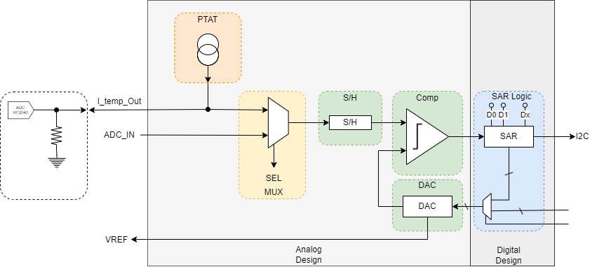

<!---

This file is used to generate your project datasheet. Please fill in the information below and delete any unused
sections.

You can also include images in this folder and reference them in the markdown. Each image must be less than
512 kb in size, and the combined size of all images must be less than 1 MB.
-->

## How it works

The project was created for a semester project for the Ceincertificate of advanced studies at the University of Applied Sciences OST Rapperswil CH. The aim is to create an ASIC using open source tools.

The aim is to create a temperature sensor using a PTAT. The voltage is to be digitalized with a SAR converter.

The following objectives are to be achieved:

- An analog design is to be created with the SKY130 process node from the circuit diagram position to the tapeout. Only freely available tools are to be used.
- The created design should be verified with the necessary simulations (pre-layout). This includes temperature, supply variation, process corners (ff,tt,ss,sf,fs) and mismatch (Monte-Carlo) 
- The design is to be created for TinyTapeout. The following requirements must be met: Size (1×2 or 2×2 tiles à 100×160 µm), supply voltage (1.8 V / 3.3 V), no use of Metal-5, maximum 6 analog I/Os, 8 digital outputs, 8 digital inputs and 8 bidirectional connections
- The design is to be submitted to the TT10 Shuttle (07.03.2025)

The following objectives are optional:

- The design is supplemented with a digital part, which is described in an HDL (mixed-signal)
- The design is verified with a mixed-signal simulation
- An evaluation logic is designed on the supplied microcontroller

The following points are not objectives of the project:

- The implemented analog design is based on a well-known and easy-to-implement circuit. The focus of the project is on the tool flow.
- The project serves to gain experience and knowledge in the field of initial chip design. No specific tasks from industry are solved or circuit parts optimized according to defined specifications.

### Task Overview

| Task Description | Status |
|------------------|--------|
| Project setup is complete and passes all tests | ✅ |
| The entire process (Schematic - Simulation - Layout - LVS - GDS) has been implemented with a simple design (inverter) | ✅ |
| Simulations can be executed using Makefiles, and tools are automated to enable work on more complex projects | ❌ |
| Specifications for the comparator are created | ❌ |
| Schematic for a comparator is completed | ❌ |
| All testbenches for the comparator are created, and the dimensions meet the requirements | ❌ |
| Requirements/specifications for the DAC are created | ❌ |
| Schematic for the DAC is completed | ❌ |
| Required testbenches for the DAC are created, and the design meets necessary requirements | ❌ |

## How to test

Desc of the Test

## External hardware

The external microcontroller (RP2040) is responsible for evaluating the ADC values.