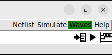
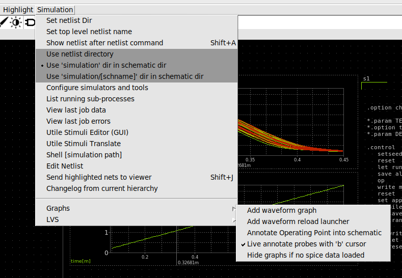
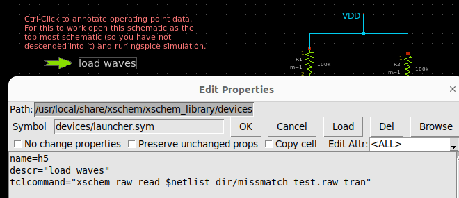
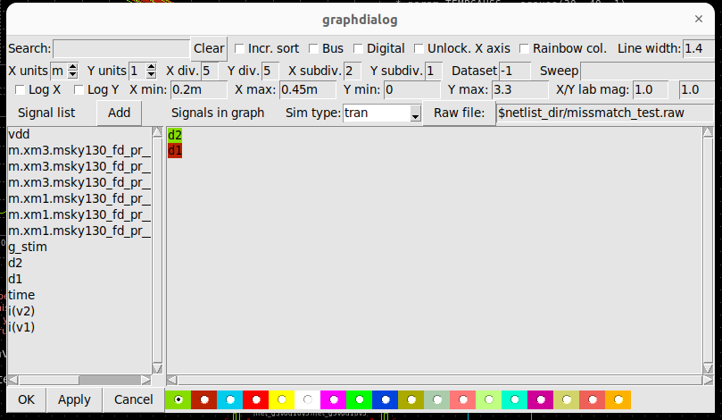

# ngspice and xschem Cheatsheet

This cheatsheet provides quick access to essential commands and workflows for ngspice and xschem.

## ngspice Simulation Commands

ngspice is a open-source SPICE simulator. Below are frequently used terminal commands for running and analyzing simulations.

| Command              | Description                                          |
| -------------------- | ---------------------------------------------------- |
| `setplot`            | Displays all simulation runs.                        |
| `setplot xx`         | Sets the active plot to `xx`.                        |
| `display`            | Lists all signals available in the current plot.     |
| `plot v(xx) v(xx)`   | Plots signals using the default x-axis scale.        |
| `setscale xx`        | Sets the x-axis scale to signal `xx`.                |
| `plot xx vs xxx`     | Plots signal `xx` against `xxx`.                     |

- Use `run` to start a simulation.
- `quit` exits ngspice.
- `show all` displays all simulation parameters.
- `write` saves simulation data to a file.

For a guide to ngspice commands, refer to the [ngspice Control Language Tutorial](https://ngspice.sourceforge.io/ngspice-control-language-tutorial.html).

## xschem Schematic Tool Commands

xschem is a graphical tool for schematic capture. Below are useful commands for manipulating schematics and symbols.

| Command              | Description                                                  |
| -------------------- | ------------------------------------------------------------ |
| `Alt` + `r`          | Rotate selected component.                                    |
| `i` / `Ctrl` + `i`   | Enter or exit a symbol to edit its sub-schematic.             |
| `e` / `Ctrl` + `e`   | Dive into or exit the schematic view of a component.          |
| `Ctrl` + LMB         | Open the schematic or corresponding SPICE file.               |
| `t`                  | Selects a single simulation run.                              |
| `Shift` + `f`        | Flips selected component horizontally.                        |

### Graph Manipulation (ngspice Plot Window)

| Command              | Description                                                                                   |
| -------------------- | --------------------------------------------------------------------------------------------- |
| `f`                  | Zooms to full view on x-axis (hover over y-axis to scale vertically).                         |
| `a` or `b`           | Places Cursor A or Cursor B.                                                                  |
| `t`                  | Selects a specific simulation run.                                                            |

### Graph Dialog (Signal Selection)

| Command              | Description                                                        |
| -------------------- | ------------------------------------------------------------------ |
| `sig:xx`             | Plots signal `xx` and labels it as `sig`.                          |

## Example Workflow (xschem + ngspice)

- **Create a schematic.**  
- Use the `netlist` button in xschem to generate SPICE netlists, then click `simulation` to launch ngspice.  
    

- **Add a waveform graph** to the schematic by navigating to `Simulation` → `Graphs` → `Add waveform graph`.  

    

- **Load a .raw file.** One option is to click the `Waves` button in the top right corner. Alternatively, use the `load waves` symbol (`launcher.sym`). Inside this symbol, you can execute TCL commands to load the file:  

    

- **Select signals to plot** once the .raw file is loaded. Double-click inside the graph to open the `graphdialog` and choose the signals you want to display:  

    
